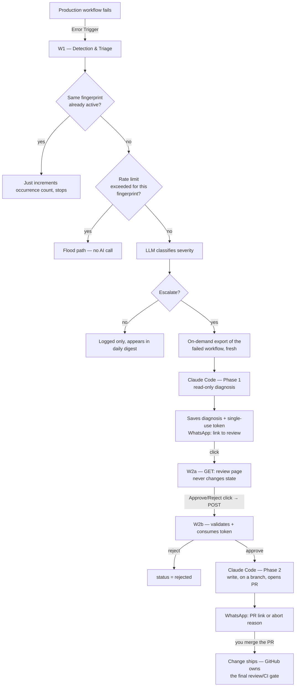
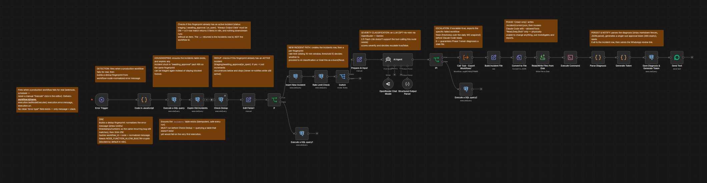
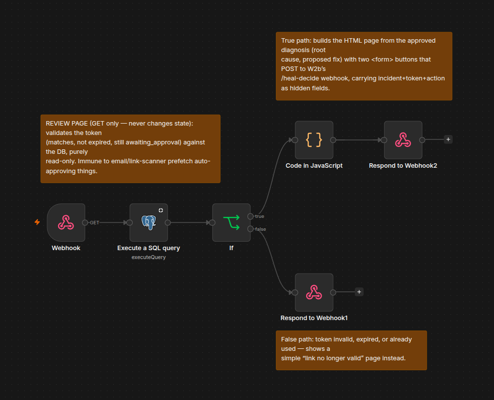
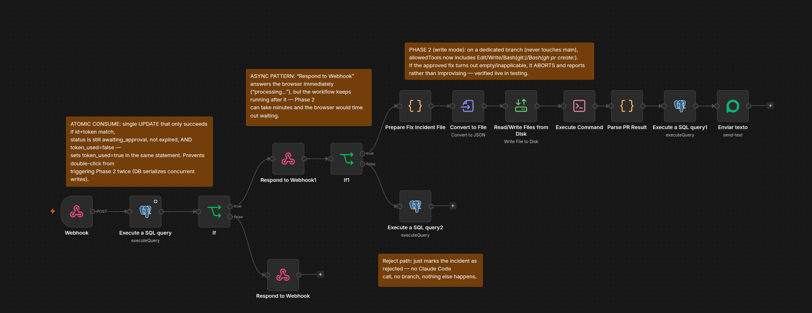
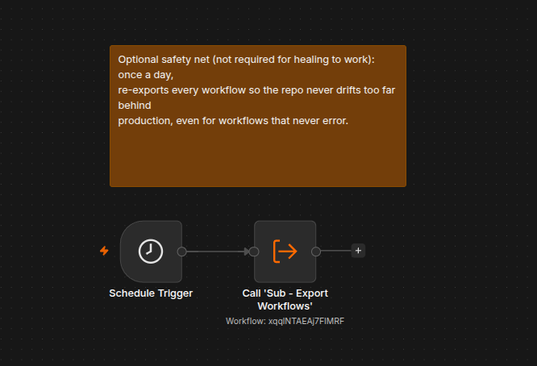
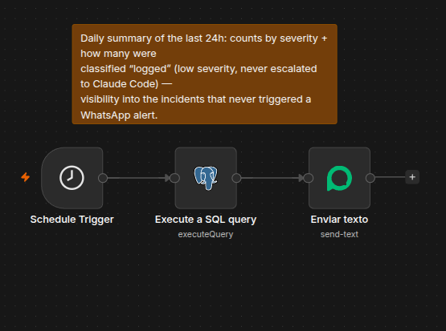

# n8n Self-Healing

A self-hosted n8n automation that turns a production workflow failure into a
full incident-response cycle: detection → AI triage → autonomous diagnosis →
human approval → autonomous fix → pull request. Built on n8n, Claude Code
(headless, on the same host), Postgres, and WhatsApp for notifications/approval.

## How it works



Two n8n workflows carry the interactive part (**W1** triage/diagnosis, **W2a/W2b**
approval/fix), a Postgres table tracks incident state, and this Git repo is the
filesystem Claude Code actually reads and writes.

### The workflows

**W1 — Detection & Triage** ([workflow](workflows/w1-detection-triage.json))


**W2a — Review Page** ([workflow](workflows/w2a-review-page.json))


**W2b — Approve & Fix** ([workflow](workflows/w2b-approve-and-fix.json))


**W0 — Daily Export** ([workflow](workflows/w0-daily-export.json))


**W-Digest — Daily Summary** ([workflow](workflows/w-digest-daily-summary.json))


## Development process

Every architecture decision, debugging call, and trade-off in this project
was made and driven by me — what to build, why a given design was safer or
simpler, which bug was the real root cause vs. a red herring, when to reject
an approach and pick a different one. Claude (AI) was used as an assistant
throughout: writing exact syntax (SQL, regex, shell quoting) I hadn't memorized,
executing and verifying infrastructure changes, and pushing back when a
decision needed a second look. I'm disclosing this openly rather than
presenting the implementation as memorized solo output, since I think how you
use AI, and whether you understand and can defend what it produces, matters
more than pretending it wasn't involved.

## Why it's built this way

- **Two separate approval gates, not one.** WhatsApp approval only authorizes
  Claude Code to *attempt* a fix on a branch. The actual code change is only
  live once you review the diff and merge the PR on GitHub — governance for
  the literal code change reuses GitHub's review/CI, instead of reinventing it.
- **GET never changes state, only POST does.** The review link (`W2a`) is a
  plain `GET` that only reads and renders — email/link-scanner prefetching it
  can't accidentally auto-approve an incident. The actual decision only fires
  on the `POST` from a button click (`W2b`).
- **Read-only vs. write are enforced by tool allowlist, not by prompt.**
  Phase 1 runs with `--allowedTools "Read,Grep,Glob"` — physically unable to
  change anything, independent of what the prompt says. Phase 2 adds
  `Edit,Write,Bash(git:*),Bash(gh pr create:*)` — write access, but `Bash` stays
  scoped to git/gh only.
- **Dedup and rate-limit solve different problems.** Dedup asks "is this exact
  error already being handled right now?" (keyed by a fingerprint of
  workflow+node+normalized message). Rate-limit asks "has this fingerprint
  fired too many times in the last 10 minutes?" — this matters specifically
  for low-severity errors that get `logged` (not escalated) and therefore
  fall outside dedup's active-incident window; without it, a noisy
  low-severity error could re-trigger AI classification every time it recurs.
- **Fail-open in triage, fail-closed in execution.** If the severity
  classifier errors or returns malformed JSON, the incident escalates by
  default — missing a real incident is worse than an unnecessary review.
  If Phase 2 finds the approved fix doesn't actually apply, it aborts and
  reports instead of improvising — verified live in testing.
- **Freshness over caching.** Instead of relying only on a daily export of
  every workflow, the triage step re-exports the *specific* failed workflow
  on demand, right before Claude Code reads it — so a diagnosis is never
  based on a stale copy.
- **Atomic token consumption.** The approval token is checked and marked
  used in a single `UPDATE ... WHERE ... RETURNING` — a double-click can't
  trigger Phase 2 twice, because the database serializes the two writes and
  only the first one matches the `WHERE` clause.

## Stack

- **n8n** — workflow engine, self-hosted natively (not Docker) on the host VM
- **Claude Code CLI** — invoked headless via `Execute Command`, once read-only
  (Phase 1) and once with scoped write access (Phase 2)
- **Postgres** — incident state (dedup, rate limiting, approval tokens, diagnosis)
- **OpenRouter (GPT-4o-mini)** — severity classification with structured output
- **Evolution API** — WhatsApp notifications and the review link
- **GitHub** — source of truth for workflow JSON, PR review/merge as the final gate

## Repo structure

```
workflows/           n8n workflows exported as JSON (source of truth)
prompts/
  diagnose.md        Phase 1 system prompt (read-only investigation)
  fix.md             Phase 2 system prompt (apply approved fix, open PR)
docs/decisions/      notes on specific design/debugging decisions made along the way
CLAUDE.md            repo-level context and hard rules for the agent
.incident/           the incident currently being processed (gitignored)
.state/              local runtime state, e.g. DB credentials (gitignored)
```

## Known limitations

- Branch protection on `main` requires GitHub Pro for a private repo — not
  enabled here; the safety net today is the tool allowlist plus the two
  approval gates, not GitHub's native protection.
- The flood/rate-limit path currently only logs — no WhatsApp alert fires
  when a fingerprint gets suppressed (easy to add, deliberately left out for now).
- A `W-Fallback` error workflow and a daily digest exist to catch failures in
  the healing pipeline itself and to summarize low-severity, never-escalated
  incidents — but they reuse simpler pre-existing infrastructure rather than
  being purpose-built for this project.
